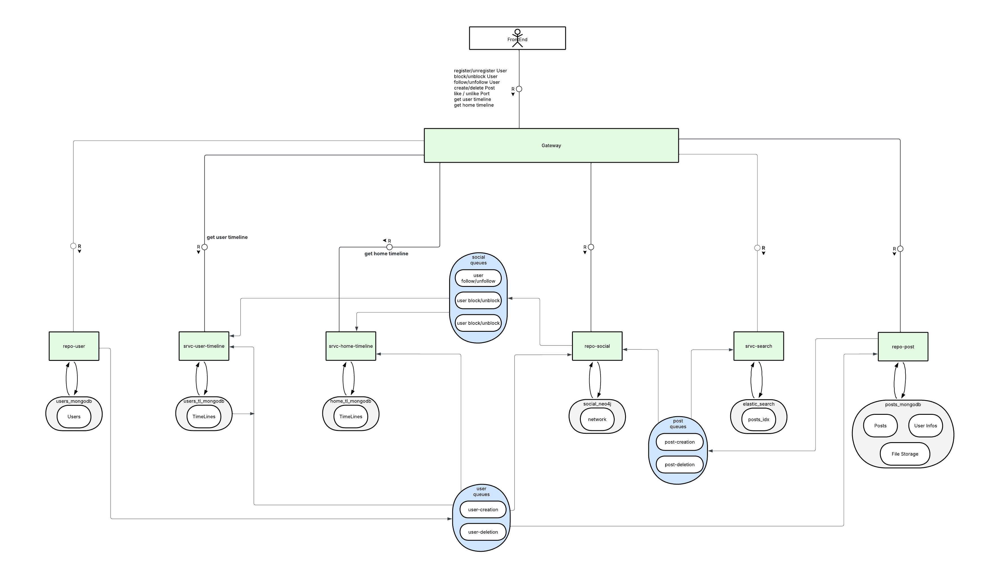

# Complete Architecture of the TinyX Project

---

## **Overview**
The goal is to create a distributed micro-blogging application inspired by Twitter (X) using a microservices architecture.  
**Core Technologies**:  
- **Language**: Java (Quarkus)  
- **Databases**: MongoDB, Neo4j, ElasticSearch  
- **Messaging**: Redis  
- **Deployment**: Kubernetes (K3S) with Kustomize  

---
## **Deployment**

### **K3S Deployment of Microservices**


### **Prerequisites**
- `kubectl` installed and configured
- `kustomize` installed (or included in your `kubectl` version)
- Access to a Kubernetes (K3S) cluster

### **Recommended Environment**
For an isolated and reproducible setup, we recommend deploying K3S in a virtual machine (as demonstrated in Kubernetes labs). This approach avoids conflicts with other installations and ensures a consistent environment.

### **Deployment Options**

#### **Option 1: Basic Deployment**
```
kubectl apply -k .
```

#### **Option 2: Verified Deployment (Recommended)**
This method waits for all services to become available, MongoDB instances to initialize, and the replica set to configure correctly:

```
./deploy.sh --apply
```

#### **Delete Deployment**
To remove all deployed resources:

```
./deploy.sh --delete
```

### **Deployment Script Features**
The `deploy.sh` script offers several advantages:
- Automatic pod status checks
- Smart waiting for MongoDB replica set initialization
- MongoDB authentication confirmation
- Visual progress feedback
- Error handling with debugging suggestions

### **Troubleshooting**
For MongoDB issues, check the replica set status with:
```
kubectl exec -n tinyx shared-mongodb-0 -- mongosh --eval "rs.status()"
```

To view all pod statuses:
```
kubectl get pods -n tinyx
```

---
## **Microservices Architecture**

**Architecture Block Diagram**  
  
>**Description**:  
>- We adopted a loosely coupled architecture to align with true microservices principles.  
>- Each service handles a specific responsibility and communicates via Redis messages and REST endpoints.  
>- Direct HTTP calls between services are avoided to prevent tight coupling.  

---
## **Services and Responsibilities**

### **1. `srvc-user`**
**Responsibilities**:  
- User management (creation, deletion).  
- Stores user data in the MongoDB `users_db`.  

>**Design Choices**:  
>- Added to handle essential user management (not explicitly required in the project scope).  
>- Manages user profiles (`username`, `nodeId`, `createdAt`) but not user relationships.  
>- Future-proof design to support additional user data (e.g., emails, personal info).  

**Technologies**:  
- **MongoDB**: Stores user data.  

**MongoDB Models**:  
```yaml
User:
  - username: String
  - nodeId: String
  - createdAt: timestamp
```

**REST Endpoints**:  
- `POST /users/create` → Creates a user.  
- `DELETE /users/{username}` → Deletes a user (sync MongoDB/Neo4j deletion, async relationship cleanup).  
- `POST /users/clear` → Clears all users (testing only).  

**Redis Events**:  
- `user-deleted` → Triggers async cleanup of FOLLOW relationships. (OUTGOING)  
- `user-created` → Notifies other services (e.g., `srvc-search`, `repo-social`). (OUTGOING)  

---

### **2. `repo-post`**  
**Responsibilities**:  
- Post creation/deletion (original, replies, reposts).  
- Post validation (e.g., reposts must reference existing posts from non-blocked users).  
- Fetches posts by `nodeId`, `postId`, or replies.  
- Triggers `srvc-search` via Redis queue for async post indexing.  
- Creates Neo4j post nodes.  

>**Design Choices**:  
>- Media attachments are stored in MongoDB and referenced via `mediaUrl`.  
>- Frontend-friendly design: posts are fetched via HTTP using the `mediaUrl`.  

**MongoDB Model**:  
```yaml
Post:
  - postId: UUID  
  - authorId: UUID  
  - authorUsername: String
  - type: "ORIGINAL" | "REPLY" | "REPOST"  
  - parentPostId: UUID?  # For replies/reposts  
  - text: String?  
  - mediaUrl: String?  
  - createdAt: timestamp
```

**Redis Events**:  
- `post-created` → Triggers ElasticSearch indexing. (OUTGOING)  
- `post-deleted` → Removes post from the index. (OUTGOING)  
- `user-deleted` → Deletes all user posts. (INCOMING)  

**REST Endpoints**:  
- `POST /posts` → Creates a post.  
- `DELETE /posts/{postId}` → Deletes a post.  
- `GET /posts/user/{username}` → Fetches all posts by a user.  
- `GET /posts/{postId}` → Fetches a specific post.  
- `GET /posts/replies/{postId}` → Fetches all replies to a post.  

---

### **3. `repo-social`**  
**Responsibilities**:  
- Manages the Neo4j database.  
- Handles user-to-user and user-to-post relationships.  

**Neo4j Models**:  
```yaml
(User)-[:FOLLOWS { since: timestamp }]->(User)
(User)-[:BLOCKS { since: timestamp }]->(User)
(User)-[:LIKES { likedAt: timestamp }]->(Post)
(User)-[:POSTED { createdAt: timestamp }]->(Post)
```

**Redis Events**:  
- `user-followed` → Updates user timelines. (OUTGOING)  
- `post-liked` → Updates user timeline status. (OUTGOING)  
- `post-unliked` → Removes post status. (OUTGOING)  
- `user-blocked` → Block relationship creation. (OUTGOING)  
- `user-unblocked` → Block relationship removal. (OUTGOING)  
- `user-unfollowed` → Follow relationship removal. (OUTGOING)  
- `user-deleted` → User deletion. (INCOMING)  
- `post-deleted` → Post deletion. (INCOMING)  

**REST Endpoints**:  
- `POST /users/{username}/like/{postId}` → Like/unlike a post.  
- `POST /users/{username}/follow/{targetUsername}` → Follow/unfollow a user.  
- `DELETE /users/{username}/follow/{targetUsername}` → Remove follow relationship.  
- `POST /users/{username}/block/{targetUsername}` → Block/unblock a user.  
- `DELETE /users/{username}/block/{targetUsername}` → Remove block relationship.  
- `GET /posts/{postId}/likeUsers` → Lists users who liked a post.  
- `GET /users/{username}/likedPosts` → Lists posts liked by a user.  
- `GET /users/{username}/followers` → Lists a user's followers.  
- `GET /users/{username}/follows` → Lists users followed by a user.  
- `GET /users/{username}/blocked` → Lists users blocked by a user.  
- `GET /users/{username}/isblocked` → Lists users who blocked a user.  

---

### **4. `srvc-search`**  
**Responsibilities**:  
- Indexes posts in ElasticSearch.  
- Handles hybrid searches (keywords + hashtags).  

**ElasticSearch Model**:  
```yaml
PostIndex:
  - postId: UUID
  - text: String
  - hashtags: List<String>
```

**Redis Events**:  
- `post-created` → Adds post to index. (INCOMING)  
- `post-deleted` → Removes post from index. (INCOMING)  

**REST Endpoints**:  
- `GET /search?q=...` → Returns matching posts.  

---

### **5. `srvc-user-timeline`**  
**Responsibilities**:  
- Generates and stores personalized user timelines via Redis.  
- Fetches stored timelines.  

>**Design Choices**:  
>- Timelines return only `postId` values to maintain service independence.  
>- Frontend retrieves post content from `repo-post`.  
>- Aligns with domain-driven design and responsibility separation.  

**MongoDB Model**:  
```yaml
UserTimeline:
  - username: String
  - posts: List<{ postId: UUID, type: "AUTHORED" | "LIKED", date: timestamp }>
  - lastUpdated: timestamp
```

**Redis Events**:  
- `post-liked` → Updates user timeline. (INCOMING)  
- `post-created` → Adds post to author's timeline. (INCOMING)  
- `post-deleted` → Removes post from timeline. (INCOMING)  

**REST Endpoints**:  
- `GET /timelines/user/{username}` → Returns user timeline.  

---

### **6. `srvc-home-timeline`**  
**Responsibilities**:  
- Generates home timelines (posts from followed users).  

>**Design Choices**:  
>- Similar to `srvc-user-timeline`, returns only `postId` values.  
>- Frontend fetches content from `repo-post`.  

**MongoDB Model**:  
```yaml
HomeTimeline:
  - username: String  
  - posts: List<{ postId: UUID, likedBy: UUID? }>  # likedBy identifies liker  
  - lastUpdated: timestamp  
```

**Redis Events**:  
- `user-followed` → Recalculates timeline. (INCOMING)  
- `post-created` → Adds post to followers' timelines. (INCOMING)  
- `post-deleted` → Removes post from all timelines. (INCOMING)  

**REST Endpoints**:  
- `GET /timelines/home/{username}` → Returns home timeline.  

---

### **7. Key Considerations**  
**Testing**:  
- Full application integration tests are in the `tests` directory.  
- Component/integration tests exist in each service.  
> **⚠️ NOTE**:  
> To run integration tests in `tests`, all services must be running.  

**Data Consistency**:  
- Use MongoDB/Neo4j transactions for critical operations (e.g., user deletion).  

**Performance**:  
- Optimize Neo4j Cypher queries to avoid complex joins.  
- Index frequently queried ElasticSearch fields (e.g., hashtags).  

**`common-tools`**:  
- Shared utility classes across services.  
- Standardizes Redis message formats to reduce coupling.  
```yaml
UserActionEvent:
  - actionType: String
  - username: String
  - targetUsername: String?
  - postId: UUID?
  - postContent: String?
  - timestamp: timestamp
```

---

## **Persistence Instances**  
### **MongoDB Instance (mongodb:27017)**  
- `users_db`  
  └── `users` (User {username, nodeId, createdAt})  
- `posts_db`  
  └── `posts` (Post {postId, authorId, text, ...})  
- `user_timelines_db`  
  └── `user_timelines` (UserTimeline {username, posts[...]})  
- `home_timelines_db`  
  └── `home_timelines` (HomeTimeline {username, posts[...]})  

### **Single Neo4j Instance**  
Used by `repo-social`.  

### **ElasticSearch Instance**  
- `srvc-search` handles indexing and queries.  
- Other services access search results via `srvc-search` REST endpoints.  

### **Redis Instance**  
- Single Redis instance with pub/sub queues for inter-service communication.
