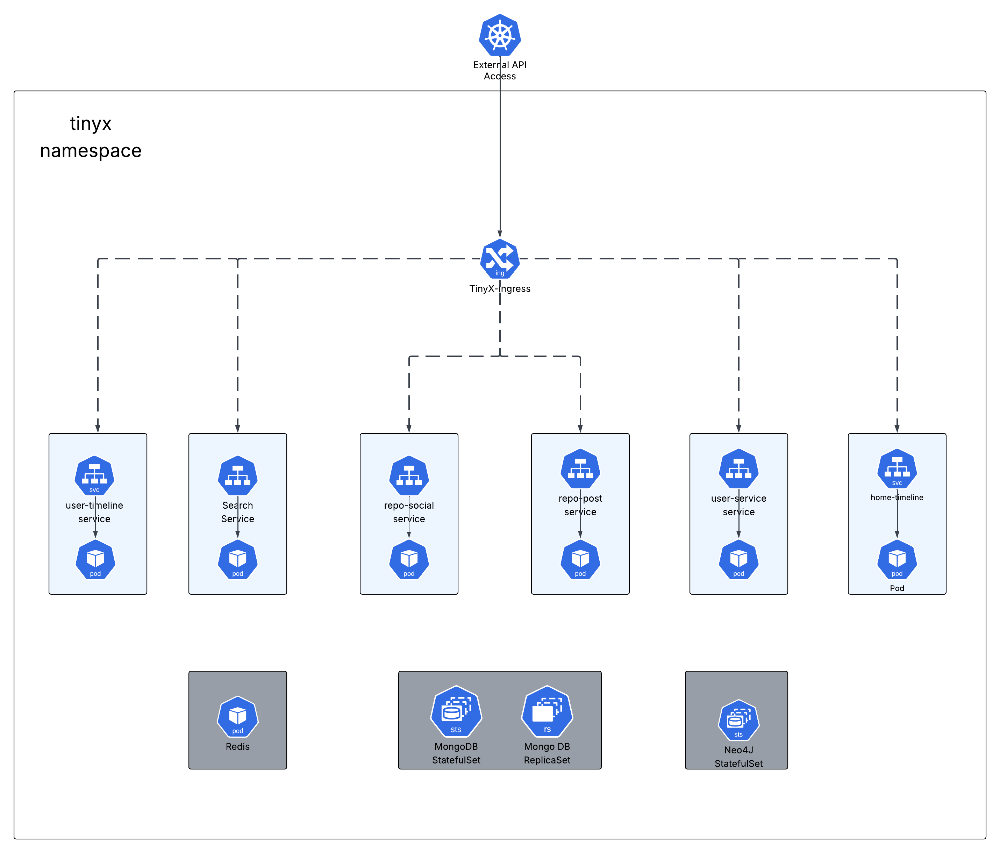
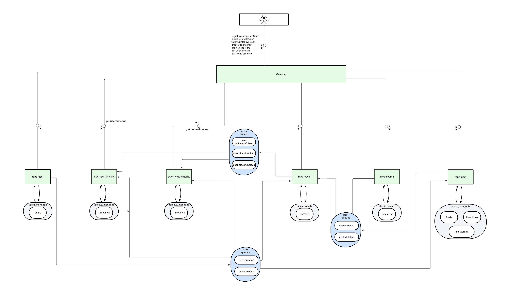

# Architecture Complète du Projet TinyX

---

## **Aperçu Général**
L'objectif est de créer une application de micro-blogging distribuée inspirée de Twitter (X) avec une architecture microservices.  
**Technologies principales** :  
- **Langage** : Java (Quarkus)  
- **Bases de données** : MongoDB, Neo4j, ElasticSearch  
- **Messagerie** : Redis  
- **Déploiement** : Kubernetes (K3S) avec Kustomize  

---
## **Déploiement**

### **Déploiement K3S des Microservices**


### **Prérequis**
- kubectl installé et configuré
- kustomize installé (ou inclus dans votre version de kubectl)
- Un cluster Kubernetes (K3S) accessible

### **Environnement recommandé**
Pour une installation isolée et reproductible, nous recommandons de déployer K3S dans une machine virtuelle (comme présenté dans les TP de Kubernetes). Cette approche permet d'éviter les conflits avec d'autres installations et de garantir un environnement cohérent.

### **Options de déploiement**

#### **Option 1: Déploiement basique**
```
kubectl apply -k .
```

#### **Option 2: Déploiement avec vérification (recommandée)**
Cette méthode attend que tous les services soient disponibles, que les instances MongoDB soient prêtes et que le replica set soit correctement initialisé:

```
./deploy.sh --apply
```

#### **Suppression du déploiement**
Pour supprimer toutes les ressources déployées:

```
./deploy.sh --delete
```

### **Fonctionnalités du script de déploiement**
Le script `deploy.sh` offre plusieurs avantages:
- Vérification automatique de l'état des pods
- Attente intelligente de l'initialisation du replica set MongoDB
- Confirmation de l'authentification MongoDB
- Feedback visuel sur l'avancement du déploiement
- Gestion des erreurs avec suggestions de débogage

### **Dépannage**
Si vous rencontrez des problèmes avec MongoDB, vous pouvez vérifier l'état du replica set avec:
```
kubectl exec -n tinyx shared-mongodb-0 -- mongosh --eval "rs.status()"
```

Pour voir l'état de tous les pods:
```
kubectl get pods -n tinyx
```

---
## **Architecture Microservices**

**Diagramme d'architecture TAM (ou block diagram) des différents services**

>**Description** :
>- Nous sommes partis sur une architecture où le couplage des services est faible afin de coller un maximum à un véritable système microservices.
>- Ainsi, chaque service est responsable d'une tâche spécifique et communique entre eux via des messages Redis et des endpoints REST.
>- Il n'y a donc pas d'appel HTTP entre service car cela créerait un couplage trop fort entre les services.

---
## **Services et Responsabilités**

### **1. `srvc-user`**
**Responsabilités** :  
- Gestion des utilisateurs (création, suppression).  
- Stock les données utilisateurs dans la base de données mongodb `users_db`.

>**Choix et justifications** :
>- Nous avons décider d'incorporer ce service qui n'est pas présent dans le sujet car il est essentiel pour la gestion des utilisateurs.
>- Il est important de noter que ce service ne gère pas les relations entre utilisateurs, mais uniquement la création et la suppression d'utilisateurs.
>- Dans le cadre actuel, la seule information importante de ce service est le `username` de l'utilisateur, qui est utilisé par les autres services pour établir des relations entre utilisateurs et posts.
>- Cependant dans une optique plus future proof, ce service gèrerait toutes les données d'un profil utilisateur tels que les données personnelles, les emails etc...

**Technologies** :  
- **MongoDB** : Stocke les données utilisateurs (`username`, `nodeId`, `createdAt`).
<!-- - **Redis** : Publie les événements `UserBlocked` pour supprimer les relations FOLLOW asynchrones.   -->

**Modèles Mongodb** :
```yaml
User:
    - username: String
    - nodeId: String
    - createdAt: timestamp
```

**Endpoints REST** :  
**Endpoints REST** :  
- `POST /users/create` → Crée un utilisateur.  
- `DELETE /users/{username}` → Supprime un utilisateur. (Suppression de l'entité mongodb et du nœud neo4j en sync, suppression des relations en async) 
- `POST /users/clear` → Supprime tous les utilisateurs. (Pour les tests uniquement)

**Evènements Redis** :
- `user-deleted` -> Déclenche la suppression des relations de follow mutuelles de manière asynchrone. `SORTANT` / `ENTRANT`
- `user-created` -> Publie l'événement pour notifier les autres services tels que `srvc-search` et `repo-social`. `SORTANT`
---

### **2. `repo-post`**  
**Responsabilités** :  
- Création/suppression de posts (originaux, replies, reposts).  
- Validation des règles appliquées aux posts (ex : un repost doit pointer vers un post existant d'un utilisateur non bloqué). 
- Récupérer des posts par grâce au nodeId, postId ou réponse d'un post spécifique.
- Déclenche le `srvc-search` avec une redis queue pour l'indexation asynchrone des posts tout juste créés ou supprimés.
- Création d'un noeud Neo4j post dans la db.

>**Choix et justifications** :
>- Lorsque nous créons un post avec un média, le média est stocké dans un stockage dédié dans la base de données MongoDB.
>- De ce fait, lorsque que l'on fetch un post, le média attaché peut être récupéré en faisant un appel http à l'url indiquée dans le champ mediaUrl.
>- Toujours dans l'optique de se coupler à un frontend, nous avons penser qu'il était préférable de renvoyer l'url pointant vers le média. (Le controller permettant de récupérer le média est déjà présent dans le service `repo-post`).

**Modèle MongoDB** :  
```yaml
Post:
  - postId: UUID  
  - authorId: UUID  
  - authorUsername: String
  - type: "ORIGINAL" | "REPLY" | "REPOST"  
  - parentPostId: UUID?  # Si reply/repost  
  - text: String?  
  - mediaUrl: String?  
  - createdAt: timestamp
```
**Redis Events** :
- `post-created` -> Déclenche l'indexation ElasticSearch. `SORTANT`
- `post-deleted` -> Supprime le post de l'index. `SORTANT`
- `user-deleted` -> Supprime tous les posts de l'utilisateur. `ENTRANT`

**Endpoints REST suggestion** : 
- `POST /posts` -> Crée un post.
- `DELETE /posts/{postId}` -> Supprime un post.
- `GET /posts/user/{username}` -> Récupérer tous les posts d'un utilisateur.
- `GET /posts/{postId}` -> Récupère un post spécifique.
- `GET /posts/replies/{postId}` -> Récupère toutes les réponses d'un post.
---
### **3. `repo-social`**
**Responsabilités** :
- Administre la base de donnée Neo4j.
- Gestion des relations entre utilisateurs et posts.

**Modèles Neo4j** :
```yaml
(User)-[:FOLLOWS { since: timestamp }]->(User)
(User)-[:BLOCKS { since: timestamp }]->(User)
(User)-[:LIKES { likedAt: timestamp }]->(Post)
(User)-[:POSTED { createdAt: timestamp }]->(Post)
```

**Evènements Redis** :
- `user-followed` -> Met à jour les timelines des utilisateurs. `SORTANT`
- `post-liked` -> Signale la mise à jour du statut d'un post pour un utilisateur et en informe le `srvc-user-timeline`.`SORTANT`
- `post-unliked` -> Signale la suppression du statut d'un post pour un utilisateur et en informe le `srvc-user-timeline`. `SORTANT`
- `user-blocked` -> Lors de la création d'une relation de blocage. `SORTANT`
- `user-unblocked` -> Lors de la suppression de la relation de blocage. `SORTANT`
- `user-unfollowed` -> Lors de la suppression de la relation de suivi. `SORTANT`
- `user-deleted` -> Lors de la suppression d'un utilisateur. `ENTRANT`
- `post-deleted` -> Lors de la suppression d'un post. `ENTRANT`

**Endpoints REST suggestion** :
- `POST /users/{username}/like/{postId}` -> Aimer/ne plus aimer un post.
- `POST /users/{username}/follow/{targetusername}` -> Suivre/ne plus suivre un utilisateur.
- `DELETE /users/{username}/follow/{targetusername}` -> Supprimer la relation de suivi.
- `DELETE /users/{username}/block/{targetusername}` -> Supprimer la relation de blocage.
- `POST /users/{username}/block/{targetusername}` -> Bloquer un utilisateur.
- `DELETE /users/{username/like/{postId}` -> Supprimer la relation de like.
- `DELETE /users/{username}/follow/{targetusername}` -> Supprimer la relation de suivi.
- `DELETE /users/{username}/block/{targetusername}` -> Supprimer la relation de blocage.
- `POST /users/{username}/block/{targetusername}` -> Bloquer un utilisateur.
- `DELETE /users/{username/like/{postId}` -> Supprimer la relation de like.
- `GET /posts/{postId}/likeUsers` -> Obtenir tous les profils qui ont aimé un post.
- `GET /users/{username}/likedPosts` -> Obtenir tous les posts aimés par un utilisateur.
- `GET /users/{username}/followers` -> Obtenir les abonnés d'un utilisateur.
- `GET /users/{username}/follows` -> Obtenir tous les utilisateurs suivis par l'utilisateur avec username.
- `GET /users/{username}/blocked` -> Obtenir tous les utilisateurs bloqués par l'utilisateur avec username.
- `GET /users/{username}/isblocked` -> Obtenir tous les utilisateurs qui ont bloqué l'utilisateur avec username.
---
### **4. `srvc-search`**
**Reponsabilités** :
- Indexation des posts dans ElasticSearch.
- Gestion des recherches hybrides (mots-clés + hashtags)

**Modèles ElasticSearch** :
```yaml
PostIndex:
    - postId: UUID
    - text: String
    - hastags: List<String>
```
**Evènements Redis** :
- `post-created` -> Émis par le `repo-post`, signale l'instruction d'ajout d'un post dans l'index. `ENTRANT`
- `post-deleted` -> Émis par le `repo-post`, signale l'instruction de suppression d'un post dans l'index. `ENTRANT`

**Endpoints REST suggestion** :
- `GET /search?q=...` -> Renvoie les posts correpondants aux critères.
---
### **5. `srvc-user-timeline`**
**Reponsabilités** :
- Génération et stockage de la timeline peronnelle d'un utilisateur grâce aux messages Redis.
- Fetch de la timeline déjà stockée.

>**Choix et justifications** :
>- Les timelines ne renvoient que les postsId car les posts sont stockés dans le service `repo-post`.
   => Par conséquent, afin de ne pas casser l'indépendance et que conceptuellement ce backend serait piloté par un frontend, nous avons considéré que les posts seraient récupérés par le frontend via le service `repo-post` et non pas via les timelines.
>- Le but des timelines étant d'aggrégger les posts et de les trier par date, il n'est pas nécessaire de stocker le contenu des posts dans les timelines.
>- Nous voulons ainsi respecter le domain driven design et la séparation des responsabilités entre les services. En effet , le service `repo-post` est responsable de la gestion des posts et de leur contenu, tandis que les services de timeline se concentrent sur l'agrégation et la présentation des posts.

**Modèles Mongodb** :
```yaml
UserTimeline:
    - username: String
    - posts: List<{ postId: UUID, type: "AUTHORED" | "LIKED", date: timestamp }>
    - lastUpdated: timestamp
```
**Evènements Redis** :
- `post-liked` -> Met à jour la timeline de l'utilisateur. `ENTRANT`
- `post-created` → Ajoute le post à la timeline de l'auteur (`authorId`). `ENTRANT`
- `post-deleted` → Supprime le post de la timeline de l'auteur. `ENTRANT`

**Endpoints REST suggestion** :
- `GET /timelines/user/{username}` -> Renvoie la timeline de l'utilisateur.
---
### **6. `srvc-home-timeline`**
**Responsabilités** :
- Génération de la timeline d'accueil (post des utilisateurs suivis).

>**Choix et justifications** :
>- Les timelines ne renvoient que les postsId car les posts sont stockés dans le service `repo-post`.
  => Par conséquent, afin de ne pas casser l'indépendance et que conceptuellement ce backend serait piloté par un frontend, nous avons considéré que les posts seraient récupérés par le frontend via le service `repo-post` et non pas via les timelines.
>- Le but des timelines étant d'aggrégger les posts et de les trier par date, il n'est pas nécessaire de stocker le contenu des posts dans les timelines.
>- Nous voulons ainsi respecter le domain driven design et la séparation des responsabilités entre les services. En effet , le service `repo-post` est responsable de la gestion des posts et de leur contenu, tandis que les services de timeline se concentrent sur l'agrégation et la présentation des posts.

**Modèles Mongodb** :
```yaml
HomeTimeline:
  - username: String  
  - posts: List<{ postId: UUID, likedBy: UUID? }>  # likedBy pour identifier le liker  
  - lastUpdated: timestamp  
```
**Evènements Redis** :
- `user-followed` -> Recalcule la timeline. `ENTRANT`
- `post-created` → Récupère la liste des **followers** de l'auteur (`authorId`) **via Neo4j**. → Pour chaque follower, ajoute le post à sa home timeline. `ENTRANT`
- `post-deleted` → Supprime le post de toutes les home timelines. `ENTRANT`

**Endpoints REST suggestion** :
- `GET /timelines/home/{username}` -> Renvoie la timeline d'acceuil.
---
### **7. Points d'attention**
**Tests** :
- Les tests d'intégration à l'échelle de l'application complète se trouve dans le dossier `tests` du projet.
- Des tests d'intégration et de composants sont également présents dans chaque service.
> **⚠️ ATTENTION :**  
> Pour lancer les tests d'intégration situés dans le dossier `tests`, il est nécessaire de lancer tous les services.

**Cohérence des données** :
- Utiliser des transactions MongoDB/Neo4j pour les opérations critiques (ex: suppression d'un utilisateur).

**Performance** :
- Limiter les jointures complexes dans Neo4j via des requêtes Cypher optimisées.
- Indexer les champs fréquemment interrogés dans ElasticSearch (ex: hashtags).

**`common-tools`** :
- Contient les classes utilitaires communes aux autres services.
- Fait office de bibliothèque de classes partagées tel que le format de message Redis. Ainsi, tous les services respectent ce format indépendant des services.
- Cela permet de réduire le couplage entre les services et d'assurer une cohérence dans la gestion des messages Redis.
```yaml
UserActionEvent:
    - actionType: String
    - username: String
    - targetUsername: String?
    - postId: UUID?
    - postContent: String?
    - timestamp: timestamp
```
---

## Instances des services de persistence
   ### MongoDB Instance (mongodb:27017)
   - users_db

     └── users (User {username, pseudo, createdAt})
   - posts_db

     └── posts (Post {postId, authorId, text, ...})

     └── Autre collections permettant d'avoir une vue sur les données des autres services nécessaires au traitement.
   - user_timelines_db

     └── user_timelines (UserTimeline {username, posts[...]})

     └── Autre collections permettant d'avoir une vue sur les données des autres services nécessaires au traitement.

   - home_timelines_db

     └── home_timelines (HomeTimeline {username, posts[...]})

     └── Autre collections permettant d'avoir une vue sur les données des autres services nécessaires au traitement.

   ### **Une seule instance Neo4j** est utilisée par le `repo-social`.  

  ### ElasticSearch Instance
  - Le service `srvc-search` est responsable de l'indexation et des requêtes de recherche.  
  - Les autres services n'ont pas besoin d'accéder à l'index ElasticSearch, car les résultats de recherche sont exposés via les endpoints REST de `srvc-search`.  
  - Cela respecte le principe de **séparation des responsabilités** et évite les couplages forts.

  ### Redis Instance
- Une instance Redis avec une flotte de queues pub/sub est utilisée pour la communication entre les services.
